# DIP virtual machine walkthrough

## 01_apache-james:

finding machine in my network


finding apache james port opened


telneting and using user naming bug to access /etc/bash_completion.d

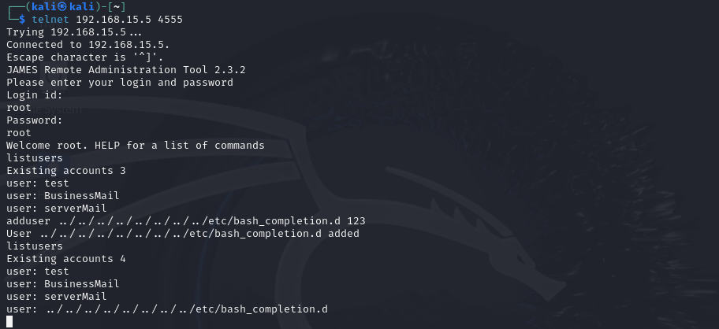

25 port also opened

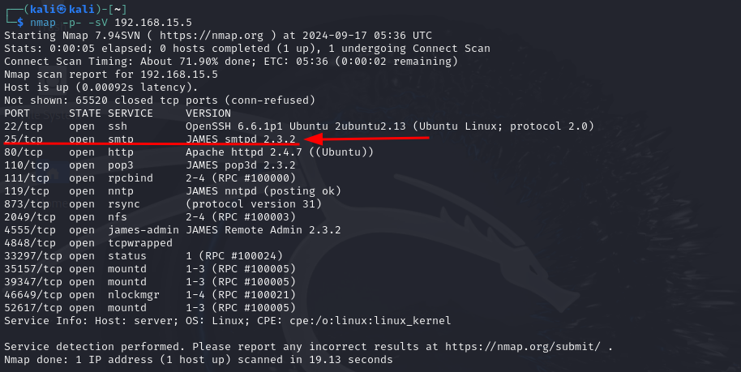

telneting to smtp and sending email


starting listening and waiting for connection from attacked machine


## 02_nfs:

nfs related ports opened


can also confirm witn rpcinfo

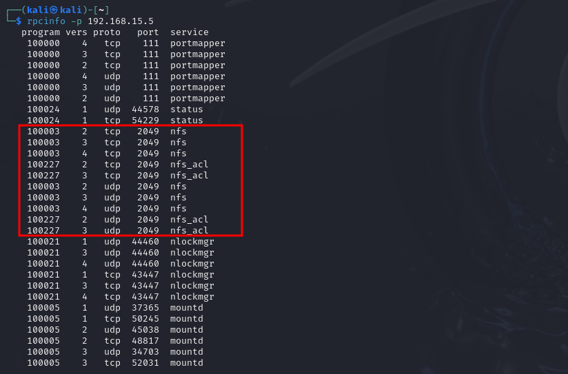

searching for related exploit


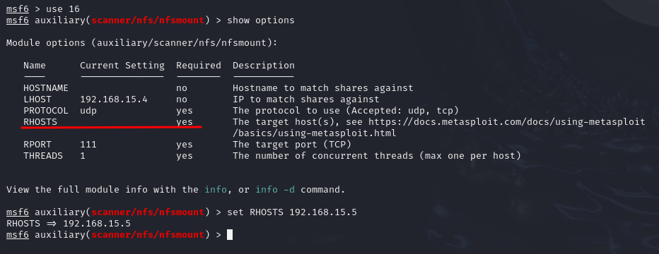


mounting the directory

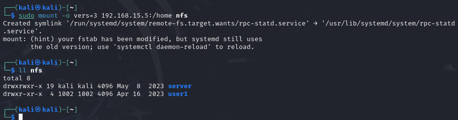

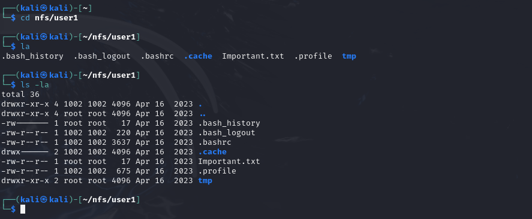

we'll try this info for ssh connection

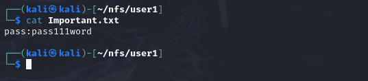

creating payload for priviledge escalation


trying secret found to ssh the machine

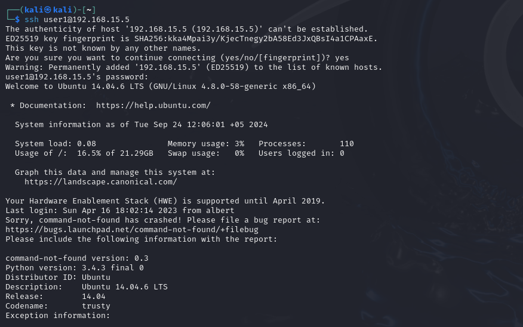

compiling payload


adding access rights


and... we are ROOT!


## 03_sudoers:

ssh opened

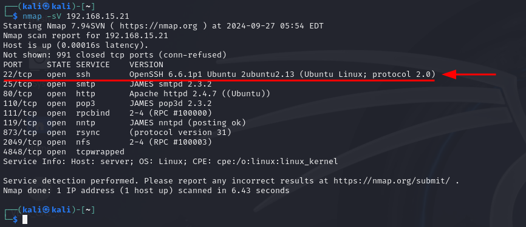

searching for relevant bruteforce tool

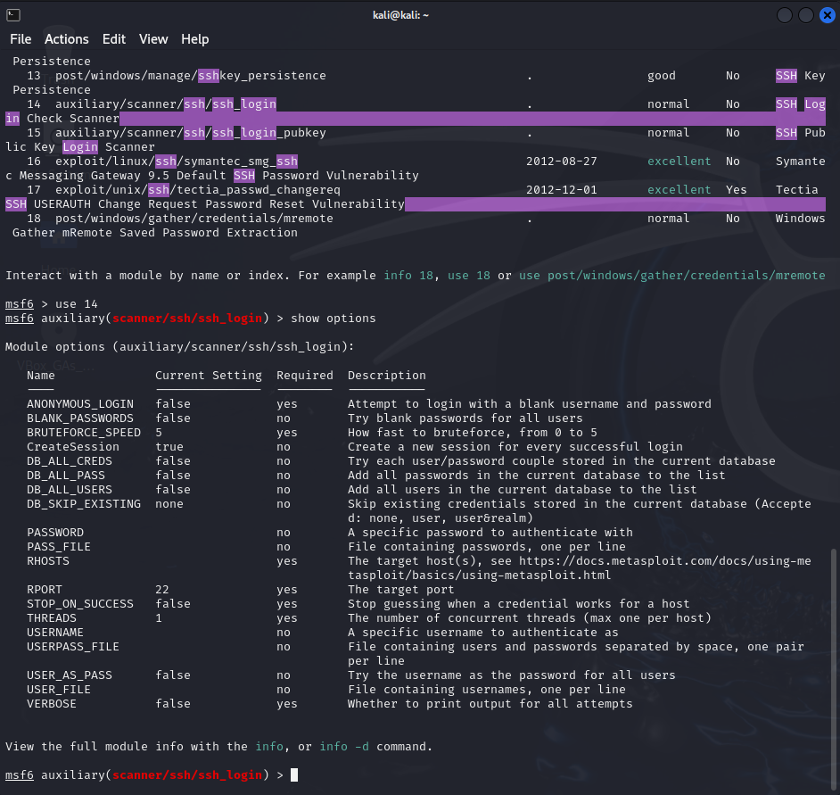

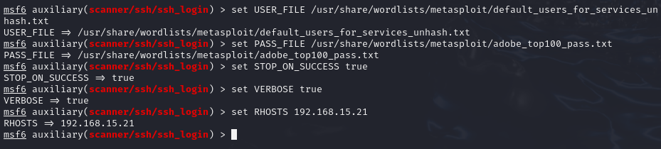

secret found

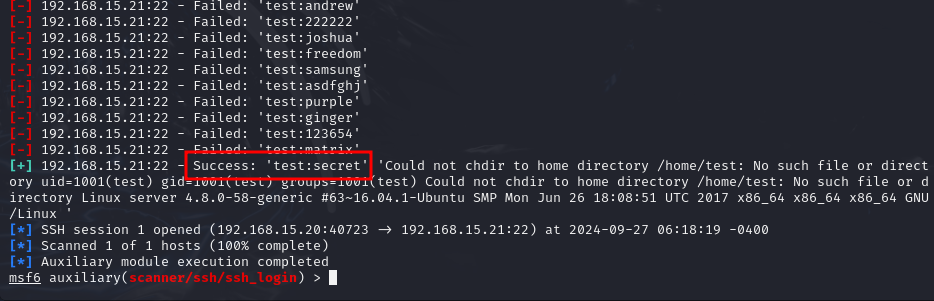

logging in via ssh


no sudo superpowers


but there are some programs listed in /etc/sudoers

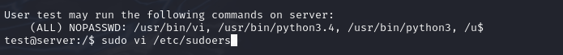


let's change it a bit


we are ROOT!


we can also run bash from vi


or run commands via python

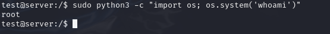

we can also read secret directly with Vi

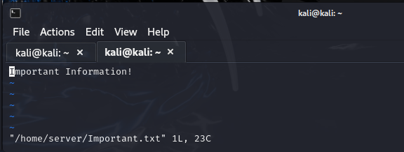

or with python oneliner


or calling sh

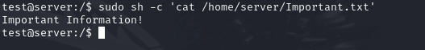

one more way - nmap script

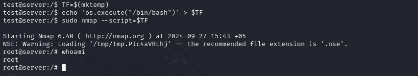

we are ROOT again!

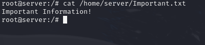

## 04_phpMyAdmin:

apache is running

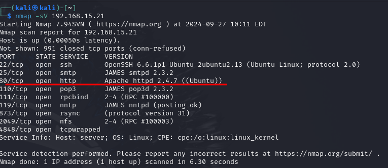

checking also with nikto


phpmyadmin detected and accessible

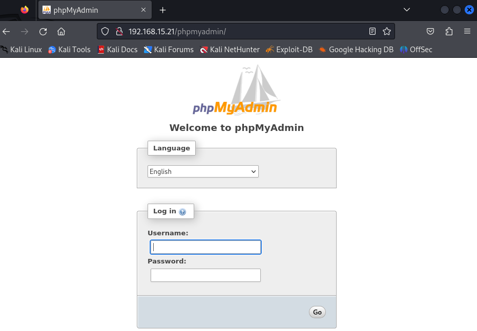

searching for relevent exploit


configuring options for brutforce

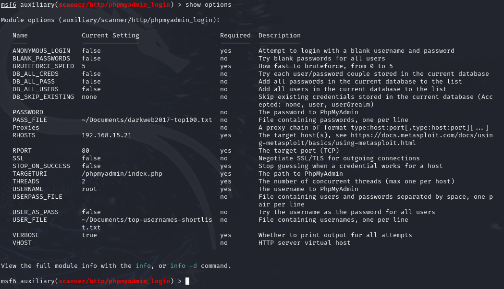

secret found


login successful

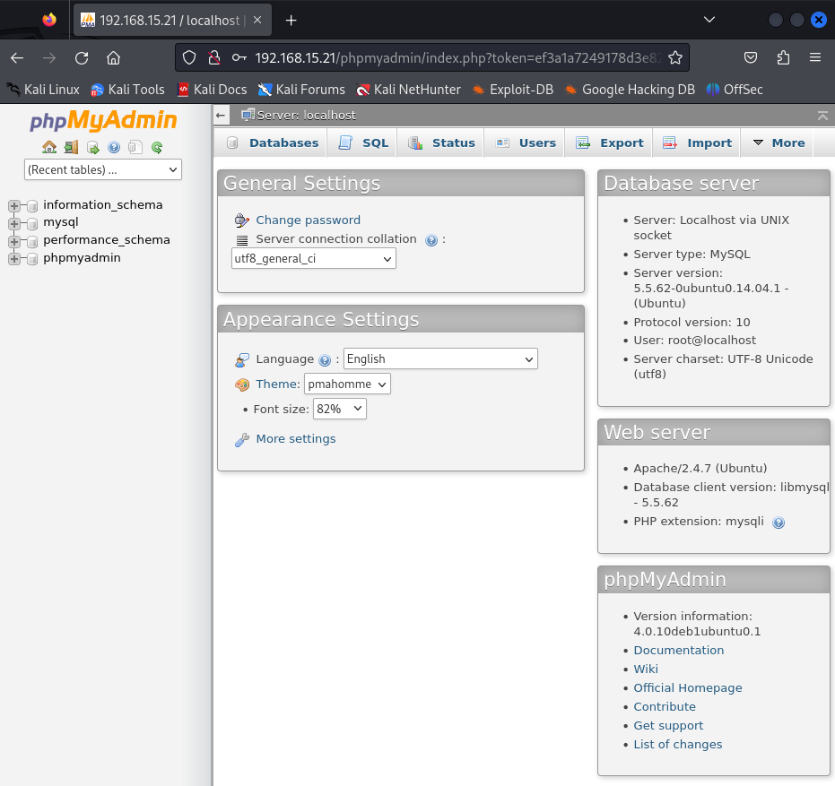

writing webshell via sql query

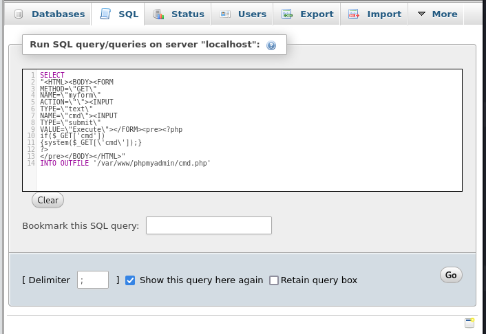


accessing webshell


folders witn 777 permissions found


system info gathered


searching for relevant exploits, I need to escalate privileges

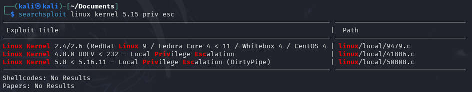


looking for sploit path

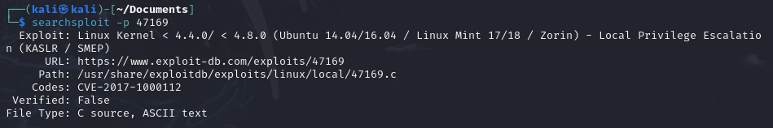

sploit shared via

```sh
python3 -m http.server
```

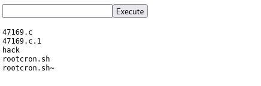

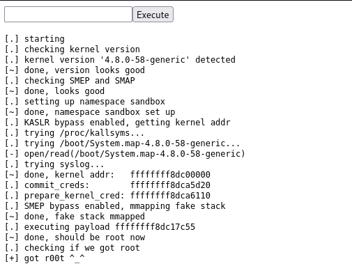

reverse shell

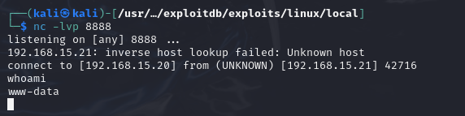

we are ROOT after running compiled sploit!


